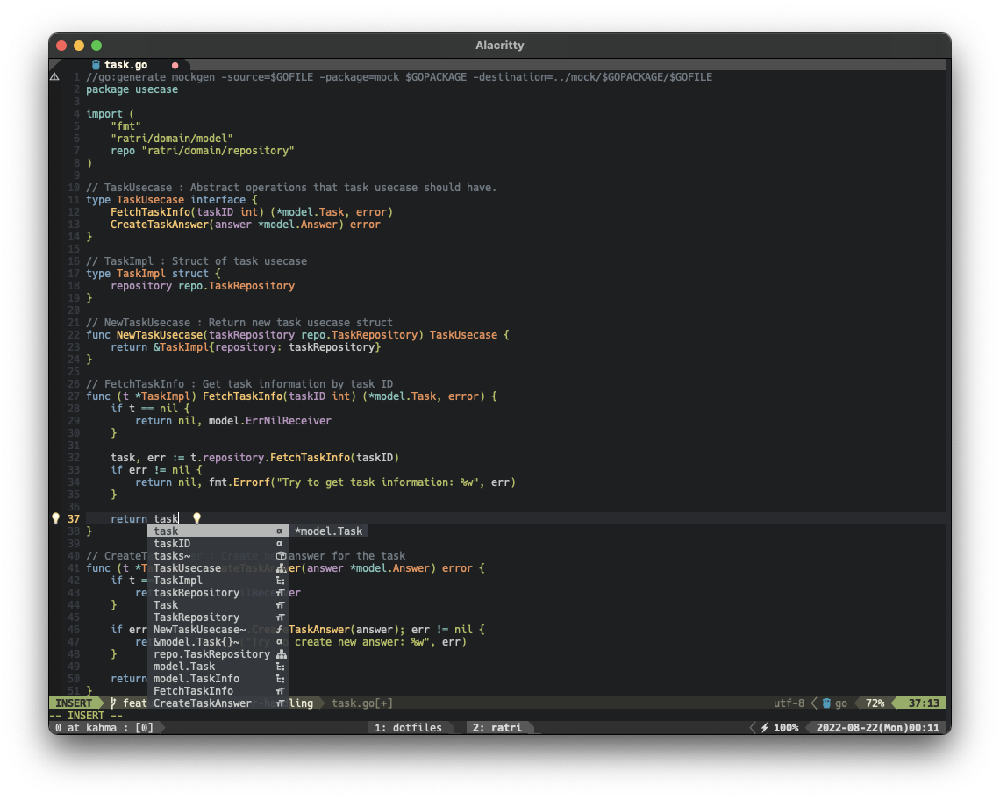
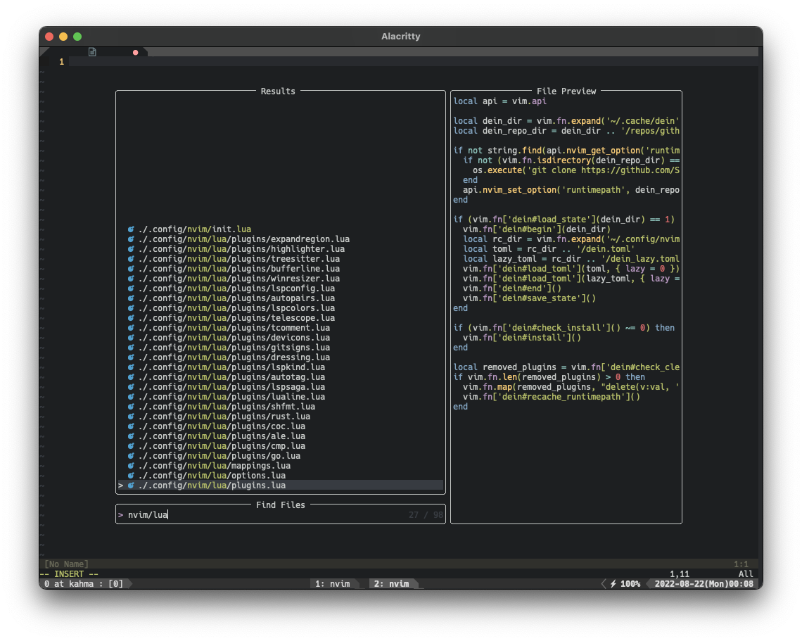

# nvim

## Screenshot

 

## plugins

|Category|name|
|:-:|:--|
|Plugin manager|[Shougo/dein.vim](https://github.com/Shougo/dein.vim)|
|Color scheme|[w0ng/vim-hybrid](https://github.com/w0ng/vim-hybrid)|
|Syntax Highlighting|[nvim-treesitter/nvim-treesitter](https://github.com/nvim-treesitter/nvim-treesitter)|
|LSP|[onsails/lspkind-nvim](https://github.com/onsails/lspkind-nvim) [hrsh7th/cmp-buffer](https://github.com/hrsh7th/cmp-buffer) [hrsh7th/cmp-nvim-lsp](https://github.com/hrsh7th/cmp-nvim-lsp) [hrsh7th/nvim-cmp](https://github.com/hrsh7th/nvim-cmp) [L3MON4D3/LuaSnip](https://github.com/L3MON4D3/LuaSnip) [glepnir/lspsaga.nvim](https://github.com/glepnir/lspsaga.nvim) [williamboman/mason.nvim](https://github.com/williamboman/mason.nvim) [williamboman/mason-lspconfig.nvim](https://github.com/williamboman/mason-lspconfig.nvim) [neovim/nvim-lspconfig](https://github.com/neovim/nvim-lspconfig)|
|Fuzzy finder|[nvim-telescope/telescope-file-browser.nvim](https://github.com/nvim-telescope/telescope-file-browser.nvim)  [nvim-telescope/telescope.nvim](https://github.com/nvim-telescope/telescope.nvim)|
|Linter/Formatter|[dense-analysis/ale](https://github.com/dense-analysis/ale)|
|Statusline|[nvim-lualine/lualine.nvim](https://github.com/nvim-lualine/lualine.nvim)|
|Tab|[akinsho/bufferline.nvim](https://github.com/akinsho/bufferline.nvim)|
|Others|[windwp/nvim-ts-autotag](https://github.com/windwp/nvim-ts-autotag)  [windwp/nvim-autopairs](https://github.com/windwp/nvim-autopairs)  [tomtom/tcomment_vim](https://github.com/tomtom/tcomment_vim)  [tpope/vim-surround](https://github.com/tpope/vim-surround)  [tpope/vim-repeat](https://github.com/tpope/vim-repeat)  [simeji/winresizer](https://github.com/simeji/winresizer)  [lewis6991/gitsigns.nvim](https://github.com/lewis6991/gitsigns.nvim)|
